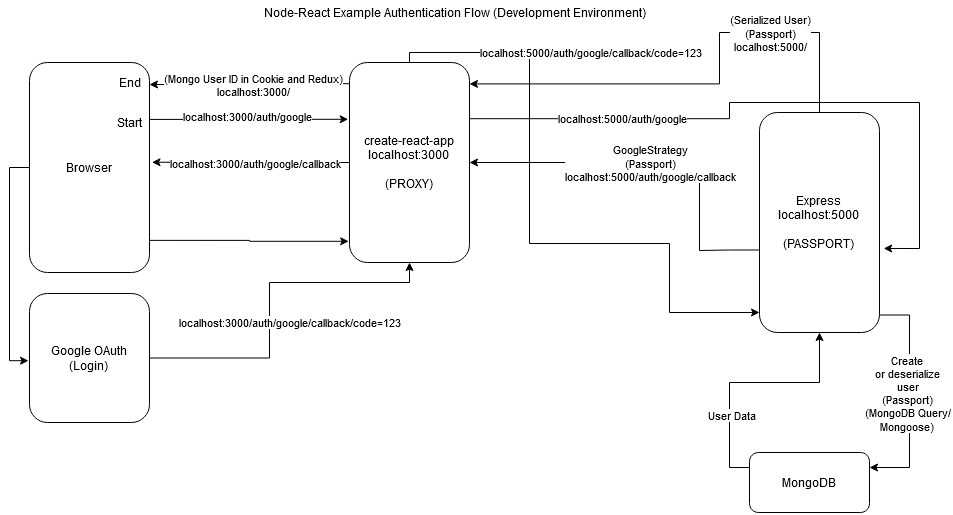
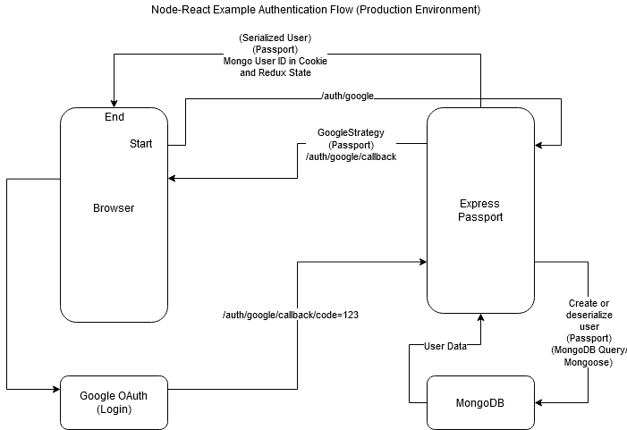

## Example Node/React Full-stack Web Application ##
This is a basic example of a Fullstack web application with Node, React, Redux,
and MongoDB based on a Udemy course.

[Heroku Example Deployment](https://enigmatic-river-32450.herokuapp.com/)

#### Requirements ####
* [Node and NPM (Node Package Manager)](https://nodejs.org/)
* [MongoDB](https://www.mongodb.com/)
* [Google OAuth 2.0 Keys](https://support.google.com/cloud/answer/6158849?hl=en)
* [A random hash or string for a cookie key](https://www.openssl.org/docs/man1.0.2/man1/rand.html)
* [A Stripe API Key](https://stripe.com/)

#### What is this repository for? ####

* A full-stack web application that allows a user to sign up, purchase credits, and then customize an email campaign for a list of email addresses.

* Version 0.1

#### How do I get set up? ####

* Clone the repo \
`git clone https://github.com/SumDimGoy/nodereact-example.git`

* Install dependencies \
`npm install`

* [Add Authorized JavaScript Origins and Redirect URIs for Google OAuth](https://developers.google.com/identity/sign-in/web/server-side-flow)

  * Development:
    * Javascript Origin:
      `<http>://<ipaddress:5000>`

    * Redirect URIs:
      `<http|https>://<ipaddress>:3000/auth/google/callback`
      `<http|https>://<ipaddress>:5000/auth/google/callback`

  * Production:
    * Javascript Origin:
      `<http|https>://<deployment URL>`

    * Redirect URIs:
      `<http|https>://<deployment URL>/auth/google/callback`

* [Create MongoDB Cluster and Database](https://docs.atlas.mongodb.com/getting-started/) \
For local Deployment, whitelist your own IP address. For Heroku/production deployment use `0.0.0.0/0`
<br>

#### Local Deployment ####
* Create config/dev.js:
  ```javascript
  module.exports = {
    googleClientID: '<Google OAuth Client ID>',
    googleClientSecret: '<Google OAuth Client Secret>',
    mongoURI: '<MongoDB Connection String>',
    cookieKey: '<Hash/Cookie Key>',
    stripePublishableKey: '<Stripe Publishable API Key>',
    stripeSecretKey: '<Stripe Secret API Key>'
  }
  ```


* To start the server: \
`npm run dev`

#### Heroku Deployment #####
* [Login to Heroku and set environment variables:](https://devcenter.heroku.com/articles/config-vars)
  ```
  GOOGLE_CLIENT_ID = <Google OAuth Client ID>
  GOOGLE_CLIENT_SECRET = <Google OAuth Client Secret>
  MONGO_URI = <MongoDB Connection String>
  COOKIE_KEY = <Hash/Cookie Key>
  STRIPE_PUBLISHABLE_KEY = <Stripe Publishable API Key>
  STRIPE_SECRET_KEY = <Stripe Secret API Key>
  ```


 * [Deploying NodeJS on Heroku](https://devcenter.heroku.com/articles/deploying-nodejs)

* It is recommended to have separate databases for each deployment. Verify that your application is running by navigating to the application's URL in the browser. To test your payment API functionality, you may use the following dummy information:

	* The verification portion is not necessary and can be closed) <br>
	<ul>Email: anyaddress@abc123.com</ul>
	<ul>Card Number: 4242 4242 4242 4242<br></ul>
	<ul>Exp: 12/20</ul>
	<ul>CVV: 123</ul>


<br><br>

